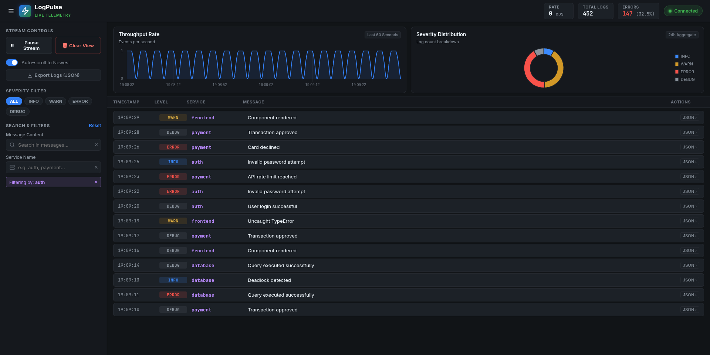
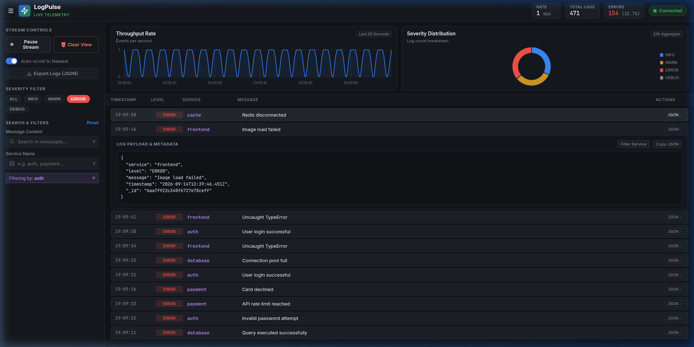

# Real-Time Distributed Log Monitoring System

A production-style distributed system for real-time log ingestion, processing, visualization, and alerting.

---
##  Architecture

```text
Client
  ↓
Flask API
  ↓
Redis Queue (Async Buffer)
  ↓
Worker (Processor)
  ├── MongoDB        → Persistent Storage
  ├── WebSocket      → Real-time Dashboard
  └── Webhooks       → Alerting System
```
---
## Features

* **Real-Time Log Streaming**: Instant event broadcasting to connected dashboards via WebSockets (Flask-SocketIO + Redis message queue).
* **Decoupled Asynchronous Queue**: Redis `log_queue` buffers high-volume ingestion, isolating the HTTP API from downstream processing.
* **Dead Letter Queue (DLQ)**: Automatic poison-pill isolation (`log_dlq`) with retry limits (`MAX_RETRIES = 3`).
* **Non-Blocking Alerting**: Asynchronous Discord/Slack webhook dispatching with anti-spam cooldowns (60s).
* **MongoDB Persistence & TTL Retention**: Compound indexing for filtered sorting and 7-day automatic TTL expiration.
* **Observability Dashboard**: Continuous 60s throughput rate chart, 24h severity breakdown, debounced search, expandable JSON inspection drawers, and export-to-JSON.
* **Containerized with Health Checks**: Zero-configuration switching between local development and Docker Compose.

---

## Tech Stack

* **Backend**: Flask, Flask-SocketIO, Python 3.11
* **Queue & Buffer**: Redis 7
* **Database**: MongoDB 6 with compound & TTL indexes
* **Frontend**: Vanilla HTML5, CSS3 (Custom Design System), JavaScript (ES6+), Chart.js
* **DevOps**: Docker, Docker Compose (with automated healthchecks)

---

## 🚀 Run the Project

### 1. Clone repo

```bash
git clone https://github.com/YOUR_USERNAME/Real-Time-Log-Monitoring-System.git
cd Real-Time-Log-Monitoring-System
```

### 2. Setup environment

```bash
cp .env.example .env
```

### 3. Start system

#### Option A: With Docker (Recommended)
```bash
docker compose up --build
```

#### Option B: Local Development
```bash
# Terminal 1: API Server
python backend/app.py

# Terminal 2: Worker Daemon
python backend/worker.py

# Terminal 3: Simulated Generator
npm run producer
```

Open `http://localhost:5000` to view the live dashboard.

---

## 🧪 Test Logging

```bash
curl -X POST http://localhost:5000/log \
-H "Content-Type: application/json" \
-d '{"service":"auth","level":"ERROR","message":"test error"}'
```

---

## System Highlights

* **Decoupled Architecture**: Ingestion API → Redis Queue Buffer → Worker Processor.
* **High Throughput & Resilient**: Non-blocking asynchronous alerts, memory-safe request payload sanitization, and dead-letter queue isolation.
* **Accurate Time-Series Telemetry**: Continuous 60-second sliding throughput metrics with zero-second idle tracking.
* **Automated Data Lifecycle**: MongoDB 7-day TTL index automatically purges stale records.

---

## ⚡ Performance Benchmarks & Stress Testing (P0 Verified)

The system was benchmarked under synthetic burst workloads using multi-threaded HTTP/1.1 pipelining against containerized Flask & Redis clusters:

| Metric Axis | Benchmark Result | Engineering Significance |
| :--- | :--- | :--- |
| **Sustained Ingestion** | **2,265+ logs/sec** | Sustained throughput across 100 concurrent pipelines without connection timeouts. |
| **Ingestion Latency (P50)** | **43.91 ms** | Fast HTTP 202 `Accepted` acknowledgment directly into Redis memory buffer. |
| **Ingestion Latency (P95)** | **60.96 ms** | Low tail latency under peak concurrent burst load. |
| **Ingestion Latency (Min)** | **9.43 ms** | Sub-10ms best-case ingestion for hot cached sockets. |
| **Success Rate** | **100.00% (5,000 / 5,000)** | Zero dropped payloads or HTTP 5xx errors during high-concurrency spikes. |
| **Redis Queue Buffer** | **Peak 2,878 logs buffered** | Absorbed peak write bursts, decoupling clients from database persistence speed. |
| **Worker Drain Time** | **3.08 seconds** | Complete recovery of consumer lag down to 0 queue depth. |
| **Dead Letter Queue (DLQ)** | **0 poison pills** | All 5,000 logs successfully parsed and processed into MongoDB. |
| **Redis Memory Footprint** | **1.15 MB → 1.17 MB** | Memory-bounded queue footprint under heavy log pressure. |

### Running the Load Test Locally

Execute the automated load testing suite via Node or Python:

```bash
# Option 1: High-throughput Node.js load tester (5,000 logs, 100 concurrent workers)
npm run stress-test

# Option 2: Python telemetry load tester (includes live Redis queue depth & memory metrics)
npm run stress-test:py
```

---

## Future Improvements

* Cloud deployment with Kubernetes / Helm chart (AWS EKS or GCP GKE)
* Role-Based Access Control (RBAC) & OAuth2 authentication
* Distributed trace ID propagation across microservices


## 📸 Dashboard & Screenshots

### 1. Live Telemetry & Ingestion Dashboard
Real-time continuous throughput rate (events/sec), 24h severity breakdown, and live incoming log stream.


### 2. Interactive JSON Inspector & Quick Actions
Click any log entry to expand an accordion drawer with formatted JSON payloads, service filtering, and clipboard copy.


### 3. Smart Alerting Notifications
Automated Discord/Slack webhook notifications triggered by rolling error thresholds with anti-spam cooldowns.


---

## Author

Sarthak Belkar
